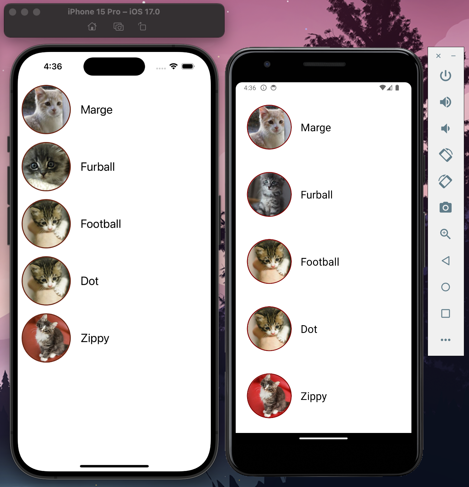

# Planned Parenthood Take Home Assignment



## 1) Code Review

### Code Smells:
- Unused `InteractionManager` import
- Business logic exists in render return (separation of concern)

### Breaking Errors:
- `ProfileImage` component:
  - Does not return JSX
  - `uri` prop does not exist on `ImagePropsBase` using built-in `<Image />` component (should be `source`)
  - `cat` reference does not exist in scope
- `EmptyView` component:
  - Text needs to be wrapped with `<Text />` component
- `<ProfileImage>` needs a closing tag in the return of the default function export

### Styling Errors:
- `SafeAreaView` container is referencing an invalid style name
- `listOfCats` mapped view is referencing an invalid style name
- `styles`:
  - profileContainer
    - `alignItem` → `alignItems`
  - profileCircle:
    - `borderRadius` needs to be a number
    - `marroon` → `maroon`
  - nameText:
    - `size` → `fontSize`
- `<Image />` component missing styling (width/height)
- Styles uses hardcoded dp values instead measured based on screen layout/pixel density

### Flaky Warnings:
- `listOfCats` array has an entry with a duplicate key
- Key not passed to `listOfCats` mapped `<View />`

### Extras:
- Converted component to TypeScript
- Extracted business logic from return
- Updated `listOfCats` use available SSL connection

## 2) Android Feature
For iOS or Android specific styling, use the built-in `Platform` module

Example:
```
padding: Platform.OS === 'android' ?  25 : 8,
```

## 3) Async and State Management
 To handle a React Native app that retrieves data from an API to share between components, I'd recommend:

- Small app
  - `fetch` and `useReducer`
- Medium/large app
  - `axios` and `redux`

For a ***small*** app, consider using `fetch` for data retrieval and `useReducer` for state management as both are built-in, lightweight, and `uesReducer` can be combined with `useContext` to create a global state management solution

For a ***medium/large*** app, consider using `axios` for data retrieval and `redux` (with either `Thunk` or `Saga` as middelware) for state management

- Redux:
  - Provides a single source of truth for app state
  - Predictable state management by use of actions
  - Powerful debugging with Redux DevTools
  - Very scalable

- Axios:
  - Simpler syntax
  - Global response interceptors
  - Request cancellation
  - Timeouts built-in